# VMware Host Configuration Assurance Workflow

```mermaid
flowchart TD
    A[🎯 Start: Config Assurance Playbook] --> B[🔍 Phase 1: Host Discovery]
    
    B --> C[Connect to vCenter Server]
    C --> D[Discover ESXi Hosts]
    D --> E[Add Hosts to Dynamic Inventory]
    
    E --> F[📋 Phase 2: Configuration Checks]
    
    F --> G[For Each ESXi Host:]
    G --> H[Collect Host Facts]
    H --> I[🕐 NTP Configuration Check]
    I --> J[🔒 Lockdown Mode Check]
    J --> K[👥 AD Join Status Check]
    
    K --> L{More Hosts?}
    L -->|Yes| G
    L -->|No| M[📊 Phase 3: Report Generation]
    
    M --> N[Aggregate Results from All Hosts]
    N --> O[Calculate Summary Statistics]
    O --> P[📄 Generate JSON Report]
    P --> Q[💾 Save config_assurance_results.json]
    
    Q --> R[🌐 Phase 4: Dashboard Display]
    R --> S[Flask Web App Loads JSON]
    S --> T[📈 Display Compliance Dashboard]
    T --> U[✅ End: View Results]
    
    %% Styling
    classDef phaseBox fill:#e1f5fe,stroke:#01579b,stroke-width:2px;
    classDef checkBox fill:#f3e5f5,stroke:#4a148c,stroke-width:2px;
    classDef reportBox fill:#e8f5e8,stroke:#1b5e20,stroke-width:2px;
    classDef dashBox fill:#fff3e0,stroke:#e65100,stroke-width:2px;
    
    class B,C,D,E phaseBox;
    class H,I,J,K checkBox;
    class N,O,P,Q reportBox;
    class R,S,T dashBox;
```

## Workflow Overview

### 🔍 **Phase 1: Host Discovery**
- **Purpose**: Identify all ESXi hosts in the vCenter environment
- **Actions**: 
  - Connect to vCenter using provided credentials
  - Query vCenter API to discover all managed ESXi hosts
  - Dynamically add discovered hosts to Ansible inventory group `discovered_esxi_hosts`

### 📋 **Phase 2: Configuration Checks**
- **Purpose**: Validate each host's configuration against compliance standards
- **Checks Performed**:
  - **NTP Configuration**: Verify time synchronization settings
  - **Lockdown Mode**: Check if host is properly secured
  - **AD Join Status**: Validate Active Directory domain membership
- **Process**: Each check returns PASS/FAIL status with expected vs actual configuration

### 📊 **Phase 3: Report Generation**
- **Purpose**: Aggregate all results into a comprehensive report
- **Data Collected**:
  - Total hosts scanned
  - Number of compliant vs non-compliant hosts
  - Individual check results per host
  - Overall compliance status
- **Output**: JSON file (`config_assurance_results.json`) with structured results

### 🌐 **Phase 4: Dashboard Display**
- **Purpose**: Provide visual representation of compliance status
- **Features**:
  - Real-time compliance ratio with visual dial
  - Host-by-host breakdown with color coding
  - Detailed drill-down for each configuration check
  - Responsive web interface accessible via browser

## Key Benefits

- **🔄 Automated**: No manual intervention required after initial setup
- **📈 Scalable**: Handles multiple hosts simultaneously
- **🎯 Targeted**: Focuses on critical security configurations
- **👁️ Visual**: Clear dashboard for quick compliance assessment
- **📊 Auditable**: Generates detailed reports for compliance tracking

## Configuration Files

- `config_assurance.yml` - Main playbook orchestrating the workflow
- `roles/vmware-host-config-assurance/` - Modular tasks for each phase
- `config_assurance_results.json` - Generated compliance report
- `config-assurance-app/` - Flask web dashboard for visualization